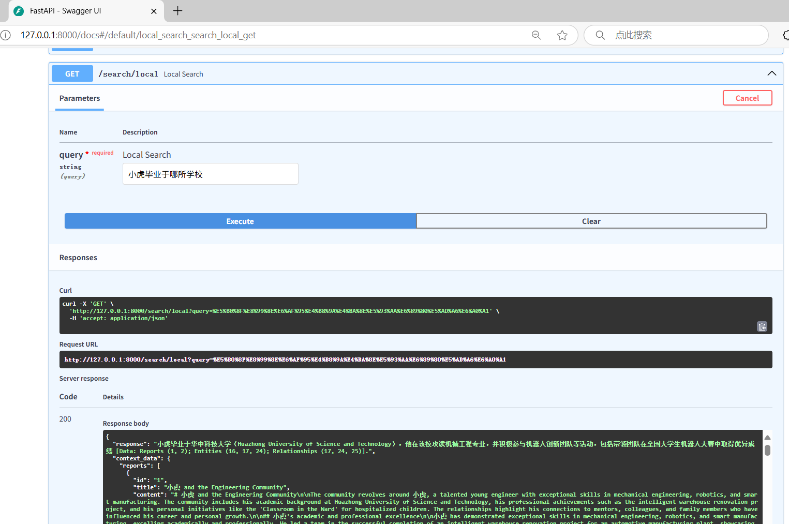
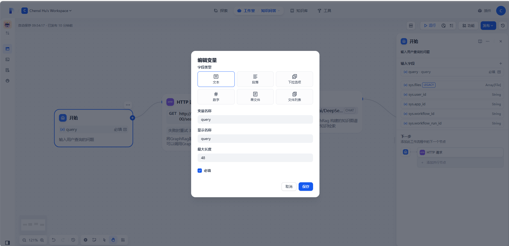
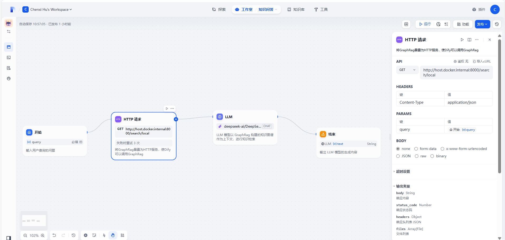
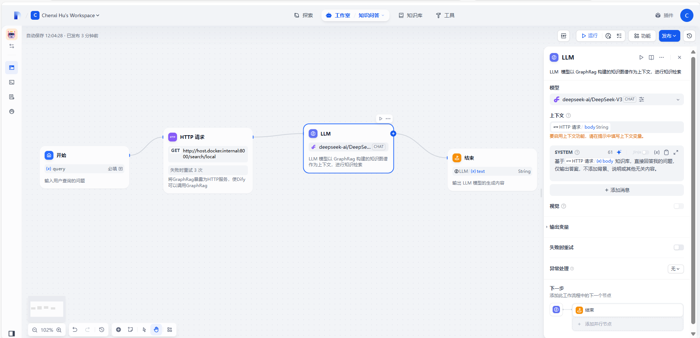
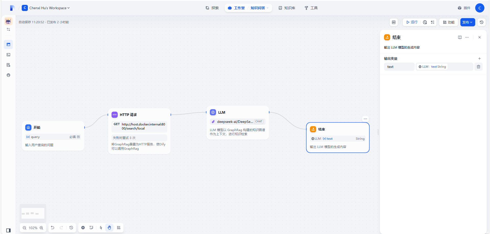
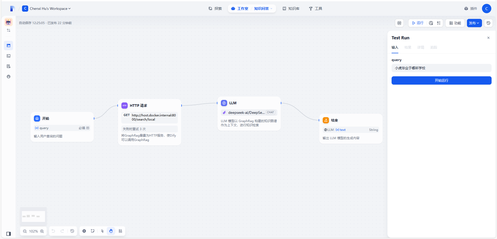
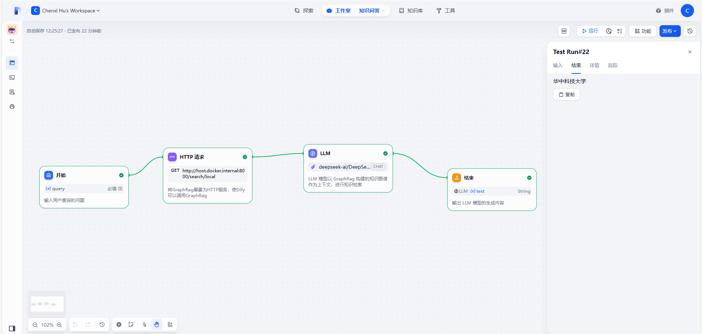
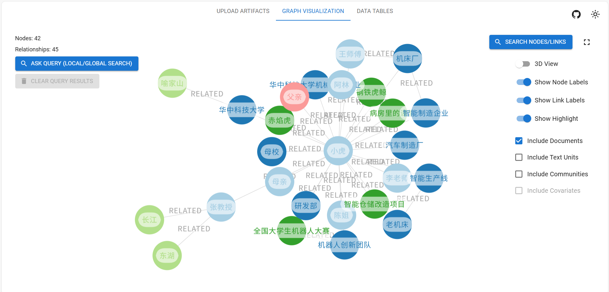

[TOC]

# Dify-GraphRag 知识库问答系统构建

## GraphRag

### GraphRag 安装与创建虚拟环境 

```bash
# 创建python3.10下的包环境，包环境名为graphrag
conda create -n graphrag python=3.10

# 激活环境
conda activate graphrag

# graphrag源代码下载
pip install graphrag
```

### GraphRag 项目配置

#### 创建检索项目文件夹

- 在`graphrag\`根目录下创建检索项目文件夹

```bash
# mkdir命令用于创建新的目录。-p选项允许用户创建多级目录结构
mkdir -p ./openl/input
```

- 然后上传数据集至`graphrag\openl\input`文件夹

#### 初始化

- 在`graphrag\`根目录下，执行以下命令，初始化项目文件

```bash
graphrag init --root ./openl
```

- 运行命令并上传测试数据集后，`graphrag\openl\`文件夹的目录结构如下：

```plaintext
graphrag/           📁 根目录
├─ openl/           📁 一级目录，检索项目文件夹
│  ├─ input/        📁 二级目录，存放数据集
│  │  ├─ 数据集.txt  📄 三级文件
│  │─ prompts/      📁 二级目录
│  ├─ .env          📄 二级文件，硅基流动 API-KEY
└─ └─ settings.yaml 📄 二级文件，配置文件
```

#### .env

- 打开`.env`文件，填写`API-KEY`

```env
# 硅基流动API-KEY
GRAPHRAG_API_KEY=your-api-key
```

#### settings.yaml

- 打开`settings.yaml`文件，填写`LLM`模型和`Embedding`模型的模型名称(`model`)、模型调用地址(`api_base`)，以及模型密钥(`api_key`)

```yaml
### This config file contains required core defaults that must be set, along with a handful of common optional settings.
### For a full list of available settings, see https://microsoft.github.io/graphrag/config/yaml/

### LLM settings ###
models:
  default_chat_model:	# LLM模型配置
    type: openai_chat
    api_base: https://api.siliconflow.cn/v1  # 统一使用硅基接口
    auth_type: api_key
    api_key: ${GRAPHRAG_API_KEY}  # 统一密钥
    model: deepseek-ai/DeepSeek-V3	# LLM模型名称
    # tiktoken 库主要用于 OpenAI 模型的分词
    encoding_model: cl100k_base  # 与 tiktoken 库兼容的编码方式
    model_supports_json: true
    concurrent_requests: 25
    async_mode: threaded
    retry_strategy: native
    max_retries: -1
    tokens_per_minute: 0
    requests_per_minute: 0

  default_embedding_model:	# Embedding模型配置
    type: openai_embedding
    api_base: https://api.siliconflow.cn/v1  # 统一使用硅基接口
    auth_type: api_key
    api_key: ${GRAPHRAG_API_KEY}  # 统一密钥
    model: BAAI/bge-m3  # Embedding模型名称
    # tiktoken 库主要用于 OpenAI 模型的分词
    encoding_model: p50k_base     # 与 tiktoken 库兼容的编码方式
    model_supports_json: true
    concurrent_requests: 25
    async_mode: threaded
    retry_strategy: native
    max_retries: -1
    tokens_per_minute: 0
    requests_per_minute: 0

### Input settings ###
input:
  type: file
  file_type: text
  base_dir: "input"

chunks:
  size: 1200
  overlap: 100
  group_by_columns: [id]

### Output/storage settings ###
output:
  type: file
  base_dir: "output"
    
cache:
  type: file
  base_dir: "cache"

reporting:
  type: file
  base_dir: "logs"

vector_store:
  default_vector_store:
    type: lancedb
    db_uri: output/lancedb
    container_name: default
    overwrite: True

### Workflow settings ###
embed_text:
  model_id: default_embedding_model
  vector_store_id: default_vector_store

extract_graph:
  model_id: default_chat_model
  prompt: "prompts/extract_graph.txt"
  entity_types: [organization, person, geo, event]
  max_gleanings: 1

summarize_descriptions:
  model_id: default_chat_model
  prompt: "prompts/summarize_descriptions.txt"
  max_length: 500

extract_graph_nlp:
  text_analyzer:
    extractor_type: regex_english

cluster_graph:
  max_cluster_size: 10

extract_claims:
  enabled: false
  model_id: default_chat_model
  prompt: "prompts/extract_claims.txt"
  description: "Any claims or facts that could be relevant to information discovery."
  max_gleanings: 1

community_reports:
  model_id: default_chat_model
  graph_prompt: "prompts/community_report_graph.txt"
  text_prompt: "prompts/community_report_text.txt"
  max_length: 2000
  max_input_length: 8000

embed_graph:
  enabled: false

umap:
  enabled: false

snapshots:
  graphml: false
  embeddings: false

### Query settings ###
local_search:
  chat_model_id: default_chat_model
  embedding_model_id: default_embedding_model
  prompt: "prompts/local_search_system_prompt.txt"

global_search:
  chat_model_id: default_chat_model
  map_prompt: "prompts/global_search_map_system_prompt.txt"
  reduce_prompt: "prompts/global_search_reduce_system_prompt.txt"
  knowledge_prompt: "prompts/global_search_knowledge_system_prompt.txt"

drift_search:
  chat_model_id: default_chat_model
  embedding_model_id: default_embedding_model
  prompt: "prompts/drift_search_system_prompt.txt"
  reduce_prompt: "prompts/drift_search_reduce_prompt.txt"

basic_search:
  chat_model_id: default_chat_model
  embedding_model_id: default_embedding_model
  prompt: "prompts/basic_search_system_prompt.txt"
```

### GraphRag 索引(`Indexing`)过程执行

- 借助`GraphRAG`脚本自动执行`indexing`

```bash
graphrag index --root ./openl
```

- 运行结束后，由测试数据集生成的知识图谱在`graphrag\openl\output`文件夹中以 `.parquet` 格式存储

## GraphRag API

- `GraphRag API`用于连接`Dify`和`GraphRag`

### GraphRag API 安装

```bash
# graphrag-api源代码下载
git clone https://github.com/noworneverev/graphrag-api

# graphrag-api根目录下打开终端
conda activate graphrag

# 安装相关依赖
pip install -r requirements.txt
```

### GraphRag API 项目配置

- 首先将`1.1`节中配置好的`graphrag`项目文件夹复制到`graphrag-api`根目录下

```plaintext
graphrag-api/          📁 根目录
├─ graphrag/           📁 一级目录
│  ├─ openl/           📁 二级目录，检索项目文件夹
│  │  ├─ input/        📁 三级目录，存放数据集
│  │  │  ├─ 数据集.txt  📄 四级文件
│  │  │─ prompts/      📁 三级目录
│  │  ├─ .env          📄 三级文件，硅基流动 API-KEY
│  └─ └─ settings.yaml 📄 三级文件，配置文件
├─ api.py              📄 一级文件
├─ config.py		   📄 一级文件
└─ requirements.txt    📄 一级文件
```

- 在`config.py`中修改`PROJECT_DIRECTORY`参数为`graphrag-api/graphrag/openl`

```python
# PROJECT_DIRECTORY 指向数据集
PROJECT_DIRECTORY = "graphrag-api/graphrag/openl"     
COMMUNITY_LEVEL = 2
CLAIM_EXTRACTION_ENABLED = False
RESPONSE_TYPE = "Single Paragraph"
```

### 启动 GraphRag  API

```bash
# graphrag-api 根目录下打开终端运行如下命令，启动 GraphRag API（端口号为8000）
python api.py
```

- 可在 http://127.0.0.1:8000/docs/ 查看`API`文档

### GraphRag API 端点介绍

- `/search/global`: Perform a global search using GraphRAG. 通过利用社区总结来进行全局性推理
- `/search/local`: Perform a local search using GraphRAG. 通过扩展相关实体的邻居和关联概念来进行具体实体的推理
- `/search/drift`: Perform a DRIFT search using GraphRAG. 结合局部搜索和社区信息，提供更准确和相关的答案
- `/search/basic`: Perform a basic search using text units. 基于文本单元的基本搜索

### GraphRag API 测试



## Dify 知识问答工作流

### Dify安装与启动

```bash
# dify 源代码下载
git clone https://github.com/langgenius/dify.git

cd dify/docker
cp .env.example .env  # 复制环境变量模板

# 启动 docker 后，终端输入如下命令，然后在浏览器中输入本机ip+端口号(127.0.0.1:8080)，即可使用 Dify
docker compose up -d
```

- 注：`Dify`官方的端口号是`80`，若有自身项目端口号与其冲突，则用记事本打开`.env`文件，将`EXPOSE_NGINX_PORT=80`修改为`EXPOSE_NGINX_PORT=8080`

### 知识问答工作流搭建 

#### 开始节点

- 功能：输入用户查询的问题
- 配置参数：
  - 输入字段：query（文本类型）



#### HTTP请求节点

- 功能：将`GraphRag`暴露为`HTTP`服务，使`Dify`可以调用`GraphRag`
- 配置参数：
  - `API`：添加`GET`请求，链接为 http://host.docker.internal:8000/search/local  （`GET`请求用于获取数据， http://host.docker.internal:8000 允许在`docker`中运行的`Dify`访问主机`localhost:8000`上运行的`Graphrag API`服务）
  - 请求头`HEADERS`：键为`Content-Type`，值为`application/json`，表明客户端期望发送或接收的数据格式为`JSON`
  - 请求参数`PARAMS`：键为`query`，值为开始节点的输入字段参数`query`，表明向服务器传递查询的具体内容
  - 请求体`BODY`：值为`none`，表明该`HTTP`请求没有携带请求体，也就是没有向服务器发送额外的具体数据内容。如在执行一个简单的搜索操作时，只需要将搜索关键词作为请求参数传递给服务器，而不需要额外的请求体数据



#### LLM节点

- 功能：`LLM`模型以`GraphRag`构建的知识图谱作为上下文，进行知识检索
- 配置参数：
  - 模型：模型供应商为硅基流动的模型`deepseek-ai/DeepSeek-V3`（与`1.1.2.4`节`settings.yaml`配置相同）
  - 上下文：选择`HTTP`请求节点的输出变量`body`（响应内容）作为`LLM`模型的上下文
  - `SYSTEM`：基于`HTTP`请求节点的输出变量`body`知识库，直接回答我的问题，仅输出答案，不添加背景、说明或其他无关内容。（`LLM`模型`Prompt`）



#### 结束节点

- 功能：输出`LLM`模型的生成内容
- 配置参数：
  - 输出变量：变量名为`text`，变量值选择`LLM`模型的输出变量`text`（生成内容）



#### 完整工作流

```yml
app:
  description: 将 GraphRag 构建的知识图谱作为 LLM 模型的知识库，构建知识问答工作流
  icon: 🤖
  icon_background: '#FFEAD5'
  mode: workflow
  name: '知识问答 '
  use_icon_as_answer_icon: false
dependencies:
- current_identifier: null
  type: marketplace
  value:
    marketplace_plugin_unique_identifier: langgenius/siliconflow:0.0.11@616842815705a8e2ecf221f1c4b6956fede54d66915286cdbed97a5405fe821d
kind: app
version: 0.1.5
workflow:
  conversation_variables: []
  environment_variables: []
  features:
    file_upload:
      allowed_file_extensions:
      - .JPG
      - .JPEG
      - .PNG
      - .GIF
      - .WEBP
      - .SVG
      allowed_file_types:
      - image
      allowed_file_upload_methods:
      - local_file
      - remote_url
      enabled: false
      fileUploadConfig:
        audio_file_size_limit: 50
        batch_count_limit: 5
        file_size_limit: 15
        image_file_size_limit: 10
        video_file_size_limit: 100
        workflow_file_upload_limit: 10
      image:
        enabled: false
        number_limits: 3
        transfer_methods:
        - local_file
        - remote_url
      number_limits: 3
    opening_statement: ''
    retriever_resource:
      enabled: true
    sensitive_word_avoidance:
      enabled: false
    speech_to_text:
      enabled: false
    suggested_questions: []
    suggested_questions_after_answer:
      enabled: false
    text_to_speech:
      enabled: false
      language: ''
      voice: ''
  graph:
    edges:
    - data:
        isInIteration: false
        isInLoop: false
        sourceType: start
        targetType: http-request
      id: 1746537817328-source-1746537829745-target
      source: '1746537817328'
      sourceHandle: source
      target: '1746537829745'
      targetHandle: target
      type: custom
      zIndex: 0
    - data:
        isInLoop: false
        sourceType: http-request
        targetType: llm
      id: 1746537829745-source-1746546004704-target
      source: '1746537829745'
      sourceHandle: source
      target: '1746546004704'
      targetHandle: target
      type: custom
      zIndex: 0
    - data:
        isInIteration: false
        isInLoop: false
        sourceType: llm
        targetType: end
      id: 1746546004704-source-1746546025324-target
      source: '1746546004704'
      sourceHandle: source
      target: '1746546025324'
      targetHandle: target
      type: custom
      zIndex: 0
    nodes:
    - data:
        desc: 输入用户查询的问题
        selected: false
        title: 开始
        type: start
        variables:
        - label: query
          max_length: 48
          options: []
          required: true
          type: text-input
          variable: query
      height: 118
      id: '1746537817328'
      position:
        x: 74.1673548021194
        y: 287.8326451978806
      positionAbsolute:
        x: 74.1673548021194
        y: 287.8326451978806
      selected: false
      sourcePosition: right
      targetPosition: left
      type: custom
      width: 244
    - data:
        authorization:
          config: null
          type: no-auth
        body:
          data: []
          type: none
        desc: 将GraphRag暴露为HTTP服务，使Dify可以调用GraphRag
        headers: Content-Type:application/json
        method: get
        params: query:{{#1746537817328.query#}}
        retry_config:
          max_retries: 3
          retry_enabled: true
          retry_interval: 100
        selected: false
        timeout:
          max_connect_timeout: 0
          max_read_timeout: 0
          max_write_timeout: 0
        title: HTTP 请求
        type: http-request
        url: http://host.docker.internal:8000/search/local
        variables: []
      height: 180
      id: '1746537829745'
      position:
        x: 405.5804619287161
        y: 238.8390761425677
      positionAbsolute:
        x: 405.5804619287161
        y: 238.8390761425677
      selected: false
      sourcePosition: right
      targetPosition: left
      type: custom
      width: 244
    - data:
        context:
          enabled: true
          variable_selector:
          - '1746537829745'
          - body
        desc: LLM  模型以 GraphRag 构建的知识图谱作为上下文，进行知识检索
        model:
          completion_params: {}
          mode: chat
          name: deepseek-ai/DeepSeek-V3
          provider: langgenius/siliconflow/siliconflow
        prompt_template:
        - id: 11621fc9-70d6-4ce9-ac0c-496c83760fa5
          role: system
          text: 基于{{#1746537829745.body#}}知识库，直接回答我的问题，仅输出答案，不添加背景、说明或其他无关内容。
        selected: false
        title: LLM
        type: llm
        variables: []
        vision:
          enabled: false
      height: 134
      id: '1746546004704'
      position:
        x: 783.4536226481601
        y: 229.33222927650274
      positionAbsolute:
        x: 783.4536226481601
        y: 229.33222927650274
      selected: true
      sourcePosition: right
      targetPosition: left
      type: custom
      width: 244
    - data:
        desc: 输出 LLM 模型的生成内容
        outputs:
        - value_selector:
          - '1746546004704'
          - text
          variable: text
        selected: false
        title: 结束
        type: end
      height: 118
      id: '1746546025324'
      position:
        x: 1168.1497554048985
        y: 294.583902139666
      positionAbsolute:
        x: 1168.1497554048985
        y: 294.583902139666
      selected: false
      sourcePosition: right
      targetPosition: left
      type: custom
      width: 244
    viewport:
      x: -29.04523889700738
      y: 34.154897572230965
      zoom: 1.0194406437021444
```

### 知识问答工作流测试





## GraphRag-Visualizer安装与配置

### 克隆源码

- `GraphRAG Visualizer` 是一款基于网页，用于可视化`GraphRAG`产物的工具。通过上传由`GraphRAG`索引管道生成的`Parquet`文件，用户无需额外的脚本或软件（`Gephi`、`Neo4j`等）即可轻松查看和分析数据。

```bash
# graphrag-visualizer源代码下载
git clone https://github.com/noworneverev/graphrag-visualizer.git   
```

### 安装依赖

- 在`graphrag-visualizer\`根目录下打开终端，执行以下命令：

```bash
# npm 是 Node.js 的默认包管理工具
npm install
```

### 可视化知识图谱

- 在`1.2.2`节的`config.py`中增加`DESTINATION_DIRECTORY`参数，其值为`graphrag-api/graphrag/openl`

```python
# 源文件夹
PROJECT_DIRECTORY = "graphrag-api/graphrag/openl"
# 目标文件夹
DESTINATION_DIRECTORY = "graphrag-visualizer/public/artifacts"
COMMUNITY_LEVEL = 2
CLAIM_EXTRACTION_ENABLED = False
RESPONSE_TYPE = "Single Paragraph"
```

- 修改`graphrag-api/api.py`文件，增加将`graphrag\openl\output`文件夹中的文件同步更新到` graphrag-visualizer\public\artifacts` 文件夹下的功能，增加代码如下：

```python
from config import DESTINATION_DIRECTORY
import os
import shutil
import time
import threading
from watchdog.observers import Observer
from watchdog.events import FileSystemEventHandler

class FileChangeHandler(FileSystemEventHandler):
    def on_modified(self, event):
        if not event.is_directory:  # 仅处理文件，忽略文件夹
            source_file = event.src_path
            target_file = source_file.replace(SOURCE_PATH, TARGET_PATH)
            # 复制更新的文件（覆盖目标文件）
            shutil.copy2(source_file, target_file)
            print(f"更新文件：{source_file} → {target_file}")
    
    def on_created(self, event):
        if not event.is_directory:
            self.on_modified(event)  # 新增文件时视为需要复制
    
    # 如需处理删除操作：
    def on_deleted(self, event):
        if not event.is_directory:
            target_file = event.src_path.replace(SOURCE_PATH, TARGET_PATH)
            if os.path.exists(target_file):
                os.remove(target_file)
                print(f"删除文件：{target_file}")

class SyncHandler(FileSystemEventHandler):
    def __init__(self, source_dir, dest_dir):
        self.source_dir = source_dir
        self.dest_dir = dest_dir

    def on_created(self, event):
        """处理创建事件"""
        if event.is_directory:
            self._copy_dir(event.src_path)
        else:
            self._copy_file(event.src_path)

    def on_modified(self, event):
        """处理修改事件"""
        if not event.is_directory:
            self._copy_file(event.src_path)

    def on_deleted(self, event):
        """处理删除事件"""
        rel_path = os.path.relpath(event.src_path, self.source_dir)
        dest_path = os.path.join(self.dest_dir, rel_path)
        if os.path.exists(dest_path):
            if os.path.isdir(dest_path):
                shutil.rmtree(dest_path)
            else:
                os.remove(dest_path)
        print(f"Deleted {dest_path}")

    def on_moved(self, event):
        """处理移动/重命名事件"""
        src_rel_path = os.path.relpath(event.src_path, self.source_dir)
        dest_src_path = os.path.join(self.dest_dir, src_rel_path)
        
        dest_rel_path = os.path.relpath(event.dest_path, self.source_dir)
        dest_new_path = os.path.join(self.dest_dir, dest_rel_path)
        
        if os.path.exists(dest_src_path):
            os.renames(dest_src_path, dest_new_path)
        print(f"Moved {dest_src_path} to {dest_new_path}")

    def _copy_file(self, src_path):
        """复制文件到目标目录"""
        rel_path = os.path.relpath(src_path, self.source_dir)
        dest_path = os.path.join(self.dest_dir, rel_path)
        os.makedirs(os.path.dirname(dest_path), exist_ok=True)
        shutil.copy2(src_path, dest_path)
        print(f"Copied {src_path} to {dest_path}")

    def _copy_dir(self, src_path):
        """创建对应目录"""
        rel_path = os.path.relpath(src_path, self.source_dir)
        dest_path = os.path.join(self.dest_dir, rel_path)
        os.makedirs(dest_path, exist_ok=True)
        print(f"Created directory {dest_path}")

def initial_sync(source, dest):
    """初始完全同步"""
    if os.path.exists(dest):
        shutil.rmtree(dest)
    shutil.copytree(source, dest)
    print("Initial synchronization completed.")
    

if __name__ == "__main__":
    # 配置同步路径
    SOURCE_DIR = f"{PROJECT_DIRECTORY}/output"  # 只监控output目录
    DEST_DIR = DESTINATION_DIRECTORY

    # 执行初始同步
    if os.path.exists(SOURCE_DIR):
        initial_sync(SOURCE_DIR, DEST_DIR)
    else:
        os.makedirs(DEST_DIR, exist_ok=True)

    # 启动监控线程
    def start_observer():
        event_handler = SyncHandler(SOURCE_DIR, DEST_DIR)
        observer = Observer()
        observer.schedule(event_handler, SOURCE_DIR, recursive=True)
        observer.start()
        print(f"Starting monitoring on {SOURCE_DIR}")
        try:
            while True:
                time.sleep(1)
        except KeyboardInterrupt:
            observer.stop()
        observer.join()
    
    # 在独立线程中启动监控
    sync_thread = threading.Thread(target=start_observer, daemon=True)
    sync_thread.start()
```

- 然后在`graphrag-visualizer\`根目录下打开终端，执行以下命令：

```bash
# 激活环境
conda active graphrag

# Graphrag-Visualizer 启动
npm start
```

- 执行完命令后，浏览器自启`Graphrag Visualizer`



## 参考资料

### github开源项目：微软GraphRag

[microsoft/graphrag: A modular graph-based Retrieval-Augmented Generation (RAG) system](https://github.com/microsoft/graphrag)

### github开源项目：GraphRag API

[noworneverev/graphrag-api: GraphRAG Server](https://github.com/noworneverev/graphrag-api)

### github开源项目：GraphRag Visualizer

[noworneverev/graphrag-visualizer: A web-based tool for visualizing and exploring artifacts from Microsoft's GraphRAG.](https://github.com/noworneverev/graphrag-visualizer)

### Dify开发文档

https://geekdaxue.co/read/dify-doc

### DeepSeek v3+GraphRAG技术实战｜DeepSeek v3知识图谱检索增强技术实战

[4.DeepSeek v3接入GraphRAG流程_哔哩哔哩_bilibili](https://www.bilibili.com/video/BV1Xwc6eoEW5/?spm_id_from=333.788.videopod.sections&vd_source=e6f77b717b1aa3a247a4a97748e510e1&p=4)